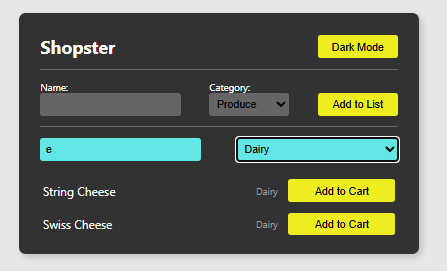
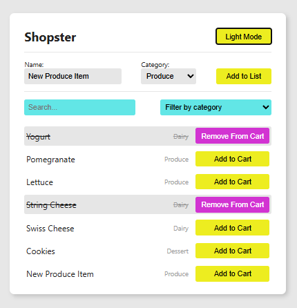

# React Controlled Components Lab

## Overview

This project expands a Shopping List application using React controlled components. The lab focuses on managing form inputs with React state, lifting state between components, and dynamically rendering filtered data.

The application supports:

- Filtering shopping list items by category
- Searching items using a controlled search input
- Adding new shopping list items through a controlled form
- Dynamically updating the UI when state changes

---

## Features Implemented

### Controlled Search Input

A controlled search field was added to the `Filter` component.

#### Functionality

- User input is stored in React state
- The search input stays synchronized with state
- Items are filtered dynamically as the user types
- Search supports:
  - Full matches
  - Partial matches
  - Case-insensitive matching

#### State Flow

```txt
ShoppingList state
→ passed to Filter as props
→ user types in input
→ state updates
→ filtered items re-render
```

---

### Controlled Form Inputs

The `ItemForm` component was updated to use controlled inputs.

#### Controlled Fields

- Item name input
- Category select dropdown

#### Form Behavior

- Form data is stored in local component state
- Inputs stay synchronized with state
- Form submission prevents page refresh
- A new item object is created and passed upward using callback props

---

### Adding New Items

New items are added to the shopping list using lifted state.

#### Data Flow

```txt
ItemForm
→ creates new item object
→ calls onItemFormSubmit callback
→ App updates items state
→ ShoppingList re-renders
```

---

## React Concepts Practiced

This lab reinforced the following React concepts:

- `useState`
- Controlled components
- Event handling
- Callback props
- Lifting state up
- Filtering arrays with `.filter()`
- Rendering lists with `.map()`
- Immutable state updates using the spread operator

---

## Component Structure

```txt
App
└── ShoppingList
    ├── ItemForm
    ├── Filter
    └── Item
```

---

## Technologies Used

- React
- JavaScript (ES6)
- Vite

---

## Screenshot

 

---

## How to Run the Project

1. Clone the repository:

```bash
git clone https://github.com/Matt20Swanberg/React-Forms-Vite-Lab
```

2. Navigate into the project directory:

```bash
cd React-Forms-Vite-Lab
```

3. Install dependencies:

```bash
npm install
```

4. Start the development server:

```bash
npm run dev
```

5. Open the local development URL provided in the terminal.

---

## Author

Created by Matthew Swanberg as part of a lab for course 4 mod 6.